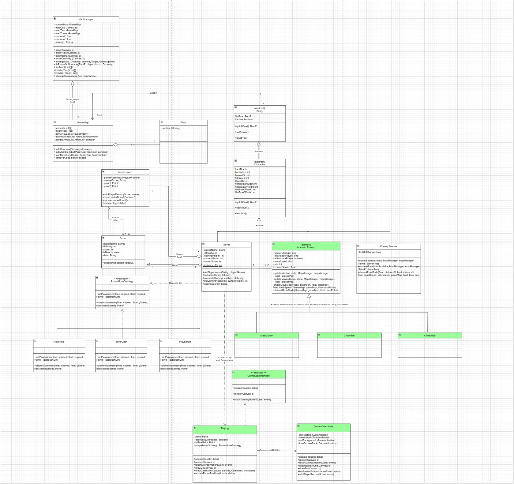

# 2D Pixel Dungeon Game

_Showcase Website_: https://clever-level-302177.framer.app/  
_A Java/Kotlin roguelike built in Android Studio (Aug 2023 – Dec 2023)_  
**Course Project – CS2340**  
**Team Size: 5** | **Architecture: MVVM** | **Game Engine: None**

---

## 👥 Team Members

- **Waiyuk Kwong** (Team Leader)  
  - Completed game framework, core code, and method interfaces  
  - Planned and assigned coding tasks  
  - Proposed features and managed animation resources

- **Nikhill Surapaneni** (Analyst)  
  - Created logic diagrams and interface relationship analysis  
  - Wrote project documentation and tracked functional progress

- **Diya Jain** (Inspector)  
  - Ensured code format and standards compliance using checkstyle

- **Vibha Guru** (Tester)  
  - Built unit tests and verified logical/game functionality

- **Anisa Wellington** (Project Coordinator)  
  - Managed tasks, tracked progress, and ensured team alignment

---

## 🛠️ System Design

This game follows the **MVVM architecture** and modular OOP design. Core design patterns such as **Singleton**, **Strategy**, **Factory**, **Decorator**, and **Observer** were used for maintainable and extensible code.  

### Class diagram


---

## 🧠 Core Design Patterns

### ✅ Singleton Pattern
Used to ensure the **Player class** has only one global instance.  
```java
public static synchronized Player getInstance() {
    if (instance == null) {
        instance = new Player(GameCharacters.WARRIOR2);
        instance.setCharStrategy(new CharThree());
    }
    return instance;
}
```

### 🧪 Factory Method Pattern
Enemies are created dynamically based on `GameCharacters` enum.  
```java
public static AbstractEnemy createEnemy(GameCharacters characterType, PointF position) {
    switch (characterType) {
        case OGRE: return new Ogre(position);
        case MINOTAUR: return new Minotaur(position);
        case ROGUE_GOBLIN: return new RogueGoblin(position);
        case STEEL_GOLEM: return new SteelGolem(position);
        default: throw new IllegalArgumentException("Unknown enemy type!");
    }
}
```

### 🔁 Observer Pattern
Used to handle **collision detection** and reactive behaviors between the player, enemies, and walls. Enables multiple subscribers to respond to game events.

### ✨ Decorator Pattern
Allows player abilities (like power-ups) to be layered dynamically without modifying the original player class.  
```java
public abstract class PlayerDecorator {
    protected Player decoratedPlayer;
}
```

### 🧠 Strategy Pattern
Encapsulates unique behaviors (attack speed, dash, defense) for each player character.  
Each strategy class (e.g., `CharOne`, `CharTwo`) implements a shared `PlayerCharStrategy` interface.

---

## 🎮 Game Mechanics Overview

### Characters
Players can choose between **Centaur**, **Witch**, or **Warrior**.  
Each has unique attributes and special abilities:
- **Walk / Run** state toggling based on control input radius
- **Dash**: Temporary invincibility and pass-through movement
- **Melee & Ranged Attacks** + a Unique Skill per character

### Enemies
- Includes types like **Ogre**, **Minotaur**, **Golem**, etc.
- Each has distinct stats and attack behavior
- Aggro triggered by proximity or ranged hits

### Items & Interaction
- Chests and collectible items provide **score**, **health**, **stat buffs**
- Interaction is contextual (auto pop-up buttons)

### Collision
- Horizontal collisions block movement
- Vertical movement unrestricted (for attack balance)
- Stun state and damage logic triggered on hit

### Scoring
- Kill enemies to earn points
- **Finish under 1m30s** for bonus
- Score leaderboard (top 6 historic scores) shown at game end

---

## 📈 Development Timeline (Sprints)

- **Sprint 1**: Game mechanics design, domain modeling, GitHub setup, basic class structures
- **Sprint 2**: MVVM setup, singleton implementation, scoring/leaderboard logic
- **Sprint 3**: Character-specific attack logic via Strategy pattern, collision detection via Observer
- **Sprint 4**: Enemy instantiation via Factory pattern, player-enemy interactions
- **Sprint 5**: Items & power-ups via Decorator pattern, UI polishing, final gameplay logic

---

## 🧪 Technical Highlights

- Built **entirely without a game engine**
- **Java** backend in Android Studio
- MVVM for separation of concerns
- Procedural map generation and object pooling
- Optimized for performance using **multithreading** and **tick-based loops**
- Comprehensive **unit testing** for all major game functions

---

## 📂 Project Structure

```
.
├── MainManager
├── Player (Singleton)
│   └── PlayerCharStrategy (Strategy Pattern)
├── EnemyFactory (Factory Method)
├── PlayerDecorator (Decorator Pattern)
├── CollisionDetector (Observer Pattern)
├── ItemSystem
├── ScoreManager
├── UI/UX Components
└── system_design.png  ← Class diagram
```

---

## 📌 Gameplay Summary

Navigate a procedurally generated dungeon filled with monsters and collectibles. Survive and reach the exit before the timer runs out. Build score through kills and efficient navigation. Every decision and power-up matters.
